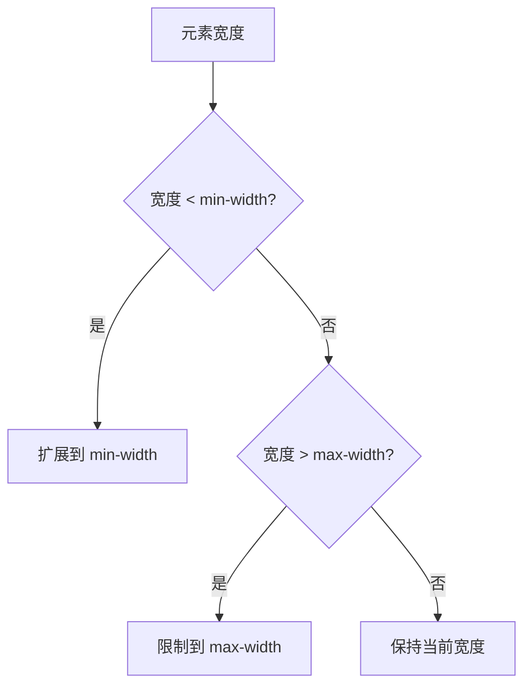

在 CSS 中，`max-width` 和 `min-width` 是两个非常有用的属性，它们允许你为元素的宽度设置上限和下限。通过使用这些属性，你可以确保元素在不同屏幕尺寸和设备上都能保持良好的布局和可读性。

## 什么是 `max-width` 和 `min-width`？

- **`max-width`**：设置元素的最大宽度。如果元素的宽度超过这个值，它将被限制在这个最大值内。
- **`min-width`**：设置元素的最小宽度。如果元素的宽度小于这个值，它将被扩展到这个最小值。

这两个属性通常用于响应式设计中，以确保元素在不同屏幕尺寸下都能保持合适的宽度。

## 如何使用 `max-width` 和 `min-width`

### 基本语法

```css
.element {
  max-width: 600px;
  min-width: 300px;
}
```

在这个例子中，`.element` 的宽度将被限制在 300px 到 600px 之间。如果内容宽度小于 300px，元素将扩展到 300px；如果内容宽度超过 600px，元素将被限制在 600px。

### 实际案例

假设你有一个包含文本的容器，你希望它在桌面设备上不超过 800px，但在移动设备上至少为 300px。你可以这样设置：

```css
.container {
  max-width: 800px;
  min-width: 300px;
  margin: 0 auto; /* 居中容器 */
  padding: 20px;
  background-color: #f0f0f0;
}
```

在这个例子中，`.container` 的宽度将在 300px 到 800px 之间变化，具体取决于屏幕尺寸。

### 响应式设计中的应用

`max-width` 和 `min-width` 在响应式设计中非常有用。例如，你可以使用媒体查询来根据屏幕尺寸调整这些值：

```css
.container {
  max-width: 100%;
  min-width: 300px;
}

@media (min-width: 768px) {
  .container {
    max-width: 800px;
  }
}
```

在这个例子中，当屏幕宽度大于或等于 768px 时，`.container` 的最大宽度将被设置为 800px。否则，它的最大宽度将为 100%。

## 图表展示

为了更好地理解 `max-width` 和 `min-width` 的行为，我们可以使用 Mermaid 图表来展示它们的工作原理。



这个图表展示了 `max-width` 和 `min-width` 如何影响元素的宽度。

## 总结

`max-width` 和 `min-width` 是 CSS 中非常有用的属性，它们可以帮助你控制元素的宽度范围，确保布局在不同设备上都能保持良好的表现。通过合理使用这些属性，你可以创建出更加灵活和响应式的网页设计。

## 附加资源与练习

- **练习**：尝试创建一个包含文本的容器，并使用 `max-width` 和 `min-width` 来限制其宽度。观察在不同屏幕尺寸下的表现。
- **资源**：阅读 [MDN 文档](https://developer.mozilla.org/zh-CN/docs/Web/CSS/max-width) 以了解更多关于 `max-width` 和 `min-width` 的详细信息。

通过不断练习和探索，你将能够更好地掌握这些属性，并在实际项目中灵活运用它们。