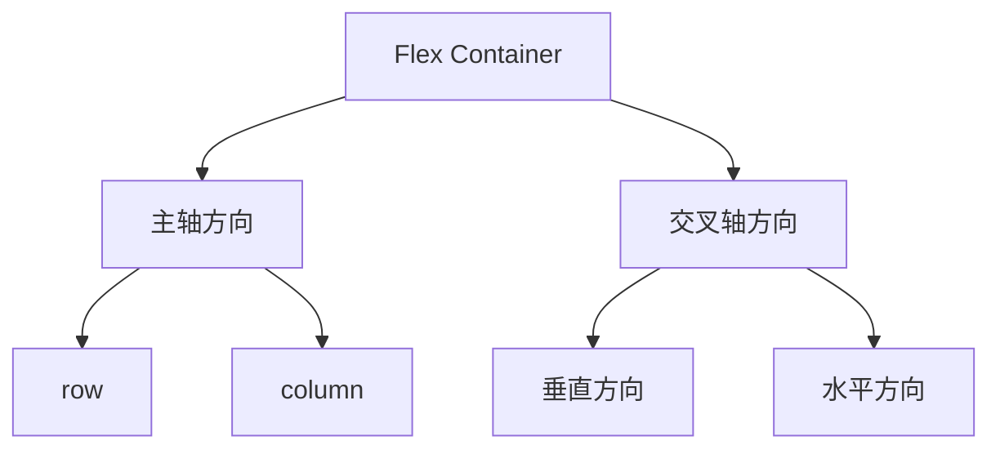

# CSS 主轴与交叉轴

在CSS弹性盒布局（Flexbox）中，**主轴（Main Axis）**和**交叉轴（Cross Axis）**是两个核心概念。理解它们的作用和关系，是掌握Flexbox布局的关键。本文将详细介绍主轴与交叉轴的定义、方向控制以及实际应用。

---

## 什么是主轴与交叉轴？

在Flexbox布局中，**主轴**是弹性容器（Flex Container）中项目（Flex Items）排列的主要方向，而**交叉轴**则是与主轴垂直的方向。主轴的方向可以通过 `flex-direction` 属性来控制，而交叉轴的方向则始终与主轴垂直。

:::note
- **主轴**：项目排列的主要方向。
- **交叉轴**：与主轴垂直的方向。
:::

---

## 主轴的方向

主轴的方向由 `flex-direction` 属性决定，它有四个可能的值：

1. **`row`**（默认值）：主轴为水平方向，从左到右。
2. **`row-reverse`**：主轴为水平方向，但从右到左。
3. **`column`**：主轴为垂直方向，从上到下。
4. **`column-reverse`**：主轴为垂直方向，但从下到上。

以下是一个示例，展示不同 `flex-direction` 值的效果：

```css
.container {
  display: flex;
  flex-direction: row; /* 默认值，水平排列 */
}
```

```html
<div class="container">
  <div>Item 1</div>
  <div>Item 2</div>
  <div>Item 3</div>
</div>
```

:::tip
尝试将 `flex-direction` 的值改为 `row-reverse`、`column` 或 `column-reverse`，观察项目排列的变化。
:::

---

## 交叉轴的方向

交叉轴的方向始终与主轴垂直。例如：
- 如果主轴是水平方向（`row` 或 `row-reverse`），则交叉轴是垂直方向。
- 如果主轴是垂直方向（`column` 或 `column-reverse`），则交叉轴是水平方向。

以下是一个示例，展示如何通过 `align-items` 属性控制交叉轴上的对齐方式：

```css
.container {
  display: flex;
  flex-direction: row; /* 主轴为水平方向 */
  align-items: center; /* 交叉轴居中对齐 */
}
```

```html
<div class="container">
  <div>Item 1</div>
  <div>Item 2</div>
  <div>Item 3</div>
</div>
```

:::caution
`align-items` 属性用于控制交叉轴上的对齐方式，而 `justify-content` 属性用于控制主轴上的对齐方式。不要混淆它们！
:::

---

## 主轴与交叉轴的关系

为了更好地理解主轴与交叉轴的关系，我们可以用以下Mermaid图表来表示：



:::note
- 当主轴为 `row` 时，交叉轴为垂直方向。
- 当主轴为 `column` 时，交叉轴为水平方向。
:::

---

## 实际应用场景

### 1. 水平居中对齐

假设我们需要将一组按钮水平居中对齐，可以使用以下代码：

```css
.container {
  display: flex;
  justify-content: center; /* 主轴居中对齐 */
}
```

```html
<div class="container">
  <button>Button 1</button>
  <button>Button 2</button>
  <button>Button 3</button>
</div>
```

### 2. 垂直居中对齐

如果我们需要将内容垂直居中对齐，可以结合 `flex-direction: column` 和 `align-items: center`：

```css
.container {
  display: flex;
  flex-direction: column; /* 主轴为垂直方向 */
  align-items: center; /* 交叉轴居中对齐 */
}
```

```html
<div class="container">
  <div>Item 1</div>
  <div>Item 2</div>
  <div>Item 3</div>
</div>
```

---

## 总结

- **主轴**是Flexbox布局中项目排列的主要方向，由 `flex-direction` 属性控制。
- **交叉轴**始终与主轴垂直，用于控制项目的对齐方式。
- 通过 `justify-content` 和 `align-items` 属性，可以分别在主轴和交叉轴上调整项目的对齐方式。

---

## 附加资源与练习

1. 尝试创建一个导航栏，使用 `flex-direction: row` 和 `justify-content: space-between` 实现左右对齐。
2. 使用 `flex-direction: column` 和 `align-items: center` 创建一个垂直居中的登录表单。
3. 阅读MDN文档中关于 [Flexbox](https://developer.mozilla.org/zh-CN/docs/Web/CSS/CSS_Flexible_Box_Layout) 的更多内容，深入了解高级用法。

通过不断练习，你将熟练掌握Flexbox布局中的主轴与交叉轴，并能够灵活运用它们创建复杂的页面布局！