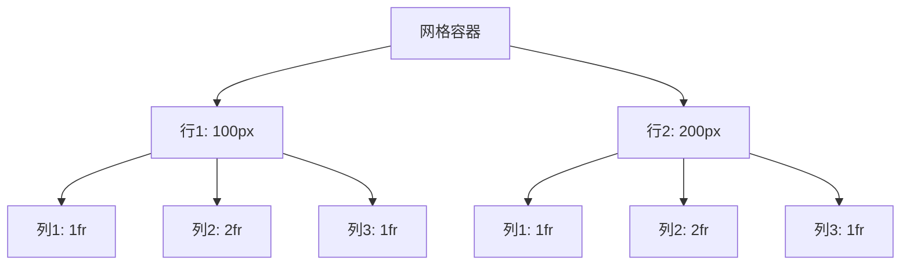

# CSS 网格容器

CSS网格布局（CSS Grid Layout）是一种强大的布局系统，允许开发者以二维方式排列网页内容。网格布局的核心是**网格容器**和**网格项**。本文将重点介绍**网格容器**，帮助你理解如何创建和管理网格布局。

## 什么是网格容器？

网格容器是CSS网格布局的基础。它是一个包含网格项的父元素，通过定义网格的行和列来控制子元素的布局。要创建一个网格容器，只需将元素的 `display` 属性设置为 `grid` 或 `inline-grid`。

```css
.container {
  display: grid;
}
```

:::note
`display: grid` 会将容器设置为块级网格容器，而 `display: inline-grid` 会将其设置为内联级网格容器。
:::

## 定义网格的行和列

网格容器的核心功能是定义网格的行和列。通过 `grid-template-rows` 和 `grid-template-columns` 属性，你可以明确指定网格的行高和列宽。

### 示例：创建一个简单的网格

以下代码定义了一个包含两行三列的网格容器：

```css
.container {
  display: grid;
  grid-template-rows: 100px 200px;
  grid-template-columns: 1fr 2fr 1fr;
}
```

:::tip
`fr` 是网格布局中的一个单位，表示“分数单位”。它用于分配剩余空间的比例。例如，`1fr 2fr` 表示第二列的宽度是第一列的两倍。
:::

### 输出效果



## 网格间距

网格容器还允许你通过 `grid-gap`（或 `gap`）属性设置行与列之间的间距。`gap` 是 `grid-gap` 的简写形式，推荐使用。

```css
.container {
  display: grid;
  grid-template-rows: 100px 200px;
  grid-template-columns: 1fr 2fr 1fr;
  gap: 10px;
}
```

:::caution
`gap` 属性会同时设置行间距和列间距。如果需要分别设置，可以使用 `row-gap` 和 `column-gap`。
:::

## 实际应用场景

### 案例：创建一个响应式布局

假设你需要创建一个响应式的网页布局，包含一个头部、一个侧边栏、一个主内容区域和一个页脚。使用网格容器可以轻松实现这一布局。

```css
.container {
  display: grid;
  grid-template-rows: auto 1fr auto;
  grid-template-columns: 200px 1fr;
  gap: 10px;
}

.header {
  grid-column: 1 / -1;
}

.sidebar {
  grid-row: 2;
}

.main {
  grid-row: 2;
  grid-column: 2;
}

.footer {
  grid-column: 1 / -1;
}
```

:::note
`grid-column: 1 / -1` 表示该元素跨越所有列。
:::

## 总结

CSS网格容器是网格布局的核心，通过定义行、列和间距，你可以轻松创建复杂的网页布局。掌握网格容器的基本概念和属性是学习CSS网格布局的第一步。

## 附加资源

- [MDN Web Docs: CSS Grid Layout](https://developer.mozilla.org/en-US/docs/Web/CSS/CSS_Grid_Layout)
- [CSS Grid Garden](https://cssgridgarden.com/) - 一个有趣的交互式学习工具。

## 练习

1. 创建一个包含三行两列的网格容器，并设置不同的行高和列宽。
2. 尝试使用 `gap` 属性调整网格间距，观察布局的变化。
3. 设计一个响应式布局，包含头部、侧边栏、主内容和页脚，并使用网格容器实现。

通过实践，你将更深入地理解CSS网格容器的强大功能！