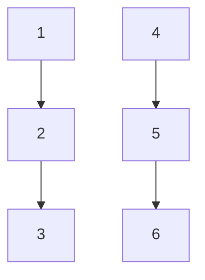
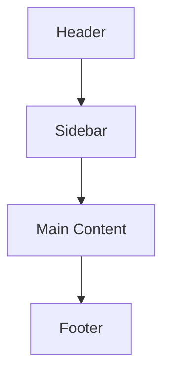

# CSS 网格实例

CSS网格布局（CSS Grid Layout）是一种强大的布局系统，允许开发者通过行和列的方式来创建复杂的网页布局。与传统的布局方式（如浮动和定位）相比，CSS网格布局更加灵活和直观，特别适合构建响应式设计。

在本教程中，我们将通过几个实际的CSS网格实例，帮助你理解网格布局的核心概念，并展示如何在实际项目中应用这些知识。

## 1. 基本网格布局

让我们从一个简单的网格布局开始。假设我们需要创建一个包含三列和两行的网格布局。

```css
.grid-container {
  display: grid;
  grid-template-columns: 1fr 1fr 1fr;
  grid-template-rows: 100px 100px;
  gap: 10px;
}
```

在这个例子中，我们定义了一个网格容器（`.grid-container`），并设置了三个等宽的列（`1fr 1fr 1fr`）和两行，每行的高度为100像素。`gap`属性用于设置网格项之间的间距。

### 示例代码

```html
<div class="grid-container">
  <div class="grid-item">1</div>
  <div class="grid-item">2</div>
  <div class="grid-item">3</div>
  <div class="grid-item">4</div>
  <div class="grid-item">5</div>
  <div class="grid-item">6</div>
</div>
```

### 输出效果



:::note
`1fr` 是CSS网格中的一个单位，表示“分数单位”（fraction unit），它会根据可用空间自动分配宽度或高度。
:::

## 2. 网格项的对齐与分布

CSS网格布局提供了多种方式来对齐和分布网格项。我们可以使用 `justify-items`、`align-items`、`justify-content` 和 `align-content` 等属性来控制网格项的对齐方式。

### 示例代码

```css
.grid-container {
  display: grid;
  grid-template-columns: 1fr 1fr 1fr;
  grid-template-rows: 100px 100px;
  gap: 10px;
  justify-items: center;
  align-items: center;
}
```

在这个例子中，我们将网格项在水平和垂直方向上都居中对齐。

### 输出效果


:::tip
`justify-items` 和 `align-items` 分别用于控制网格项在行和列方向上的对齐方式。`justify-content` 和 `align-content` 则用于控制整个网格在容器中的对齐方式。
:::

## 3. 响应式网格布局

CSS网格布局非常适合构建响应式设计。我们可以使用媒体查询（Media Queries）来调整网格布局，使其在不同屏幕尺寸下表现良好。

### 示例代码

```css
.grid-container {
  display: grid;
  grid-template-columns: repeat(auto-fit, minmax(200px, 1fr));
  gap: 10px;
}

@media (max-width: 600px) {
  .grid-container {
    grid-template-columns: 1fr;
  }
}
```

在这个例子中，我们使用了 `repeat(auto-fit, minmax(200px, 1fr))` 来创建一个自适应的网格布局。当屏幕宽度小于600像素时，网格将变为单列布局。

### 输出效果


:::caution
在使用 `auto-fit` 和 `minmax` 时，确保设置的最小宽度（`minmax` 的第一个参数）适合你的设计需求，以避免布局在小屏幕上出现问题。
:::

## 4. 实际应用案例

让我们来看一个实际的应用场景：创建一个简单的博客布局。这个布局包含一个头部、一个侧边栏、一个主内容区域和一个页脚。

### 示例代码

```css
.blog-layout {
  display: grid;
  grid-template-areas:
    "header header"
    "sidebar main"
    "footer footer";
  grid-template-columns: 200px 1fr;
  grid-template-rows: auto 1fr auto;
  gap: 10px;
  height: 100vh;
}

.header { grid-area: header; }
.sidebar { grid-area: sidebar; }
.main { grid-area: main; }
.footer { grid-area: footer; }
```

### HTML结构

```html
<div class="blog-layout">
  <header class="header">Header</header>
  <aside class="sidebar">Sidebar</aside>
  <main class="main">Main Content</main>
  <footer class="footer">Footer</footer>
</div>
```

### 输出效果



:::warning
在使用 `grid-template-areas` 时，确保每个网格区域都有对应的HTML元素，并且名称匹配。
:::

## 总结

通过以上实例，我们学习了如何使用CSS网格布局来创建基本的网格、对齐网格项、构建响应式布局以及在实际项目中应用网格布局。CSS网格布局是一个非常强大的工具，掌握它将极大地提升你的网页设计能力。

## 附加资源与练习

- **练习1**：尝试创建一个包含四列和三行的网格布局，并使用 `justify-content` 和 `align-content` 属性来调整网格在容器中的位置。
- **练习2**：使用媒体查询创建一个响应式网格布局，使其在移动设备上显示为单列，在桌面设备上显示为多列。

:::tip
更多关于CSS网格布局的详细信息，可以参考 [MDN Web Docs](https://developer.mozilla.org/zh-CN/docs/Web/CSS/CSS_Grid_Layout)。
:::

希望这些实例能帮助你更好地理解CSS网格布局，并在实际项目中灵活运用！