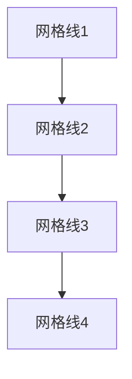

# CSS 网格线

CSS网格布局（CSS Grid Layout）是一种强大的布局系统，允许开发者通过定义行和列来创建复杂的网页布局。在网格布局中，**网格线**（Grid Lines）是构成网格结构的基础元素。它们定义了网格的行和列的边界，帮助我们精确控制网格项（Grid Items）的位置和大小。

## 什么是网格线？

网格线是网格布局中不可见的垂直线和水平线，它们将网格划分为行和列。每一条网格线都有一个编号，从1开始，从左到右（对于列）和从上到下（对于行）。例如，一个3列的网格将有4条垂直线（列线），编号为1到4。



## 如何使用网格线？

在CSS中，我们可以通过指定网格线的编号来放置网格项。以下是一个简单的示例，展示如何使用网格线来定义一个3列2行的网格布局：

```css
.container {
  display: grid;
  grid-template-columns: 100px 200px 100px;
  grid-template-rows: 100px 100px;
  gap: 10px;
}

.item1 {
  grid-column: 1 / 3; /* 从第1条列线到第3条列线 */
  grid-row: 1 / 2;    /* 从第1条行线到第2条行线 */
}

.item2 {
  grid-column: 2 / 4; /* 从第2条列线到第4条列线 */
  grid-row: 2 / 3;    /* 从第2条行线到第3条行线 */
}
```

在这个示例中，`.container` 是一个网格容器，定义了3列和2行。`.item1` 和 `.item2` 是网格项，分别通过 `grid-column` 和 `grid-row` 属性指定了它们的位置。

:::note
**注意**：网格线的编号从1开始，而不是0。
:::

## 网格线的命名

除了使用编号，我们还可以为网格线命名，以便更直观地引用它们。以下是一个使用命名网格线的示例：

```css
.container {
  display: grid;
  grid-template-columns: [start] 100px [middle] 200px [end] 100px;
  grid-template-rows: [row1-start] 100px [row1-end row2-start] 100px [row2-end];
}

.item1 {
  grid-column: start / middle;
  grid-row: row1-start / row1-end;
}

.item2 {
  grid-column: middle / end;
  grid-row: row2-start / row2-end;
}
```

在这个示例中，我们为列线和行线分别命名，使得代码更具可读性。

## 实际应用场景

网格线在实际开发中非常有用，尤其是在需要创建复杂布局时。以下是一个常见的应用场景：

### 网页布局

假设我们需要创建一个典型的网页布局，包含头部、侧边栏、主内容和页脚。我们可以使用网格线来定义这些区域的位置：

```css
.container {
  display: grid;
  grid-template-columns: [sidebar-start] 200px [sidebar-end content-start] 1fr [content-end];
  grid-template-rows: [header-start] 100px [header-end main-start] 1fr [main-end footer-start] 50px [footer-end];
}

.header {
  grid-column: sidebar-start / content-end;
  grid-row: header-start / header-end;
}

.sidebar {
  grid-column: sidebar-start / sidebar-end;
  grid-row: main-start / main-end;
}

.main-content {
  grid-column: content-start / content-end;
  grid-row: main-start / main-end;
}

.footer {
  grid-column: sidebar-start / content-end;
  grid-row: footer-start / footer-end;
}
```

在这个布局中，我们使用命名网格线来定义头部、侧边栏、主内容和页脚的位置，使得布局更加清晰和易于维护。

## 总结

CSS网格线是网格布局中的核心概念，它们帮助我们精确控制网格项的位置和大小。通过使用网格线的编号或命名，我们可以创建出复杂且灵活的网页布局。

:::tip
**提示**：在实际开发中，建议使用命名网格线，以提高代码的可读性和可维护性。
:::

## 附加资源与练习

- **练习**：尝试创建一个包含3列和3行的网格布局，并使用网格线将不同的网格项放置在不同的位置。
- **资源**：阅读 [MDN文档](https://developer.mozilla.org/zh-CN/docs/Web/CSS/CSS_Grid_Layout) 以深入了解CSS网格布局的其他高级特性。

通过掌握CSS网格线，你将能够更高效地创建复杂的网页布局，提升你的前端开发技能。