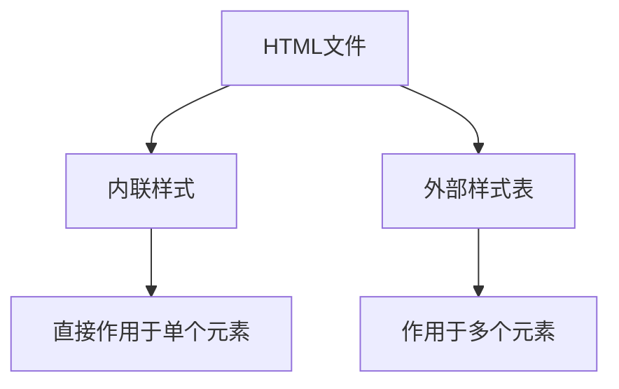

# HTML 内联样式

在网页开发中，HTML用于定义内容结构，而CSS用于控制内容的样式。通常情况下，我们会将CSS代码放在外部样式表或`<style>`标签中。然而，在某些情况下，我们可能需要直接在HTML元素中应用样式，这就是**内联样式**的用途。

## 什么是内联样式？

内联样式是指将CSS样式直接写在HTML元素的`style`属性中。这种方式允许我们为单个元素定义独特的样式，而不需要依赖外部样式表或`<style>`标签。

### 语法

内联样式的语法非常简单，只需要在HTML元素的`style`属性中写入CSS规则即可。例如：

```html
<p style="color: red; font-size: 20px;">这是一个红色的段落。</p>
```

在这个例子中，`<p>`元素的文本颜色被设置为红色，字体大小为20像素。

:::note
内联样式仅作用于当前元素，不会影响其他元素。这使得它非常适合用于快速测试或为特定元素添加独特样式。
:::

## 内联样式的优点与缺点

### 优点
1. **快速实现**：无需创建外部样式表或`<style>`标签，可以直接在HTML中应用样式。
2. **优先级高**：内联样式的优先级高于外部样式表和`<style>`标签中的样式，适合覆盖其他样式。
3. **适合小规模修改**：当只需要为少数元素添加样式时，内联样式非常方便。

### 缺点
1. **难以维护**：如果多个元素需要相同的样式，内联样式会导致代码重复，增加维护成本。
2. **不利于复用**：内联样式无法复用，无法通过类或ID统一管理样式。
3. **代码可读性差**：过多的内联样式会使HTML代码变得冗长，降低可读性。

## 实际应用场景

### 1. 快速测试样式
在开发过程中，你可能需要快速测试某个元素的样式效果。使用内联样式可以立即看到结果，而不需要修改外部CSS文件。

```html
<div style="background-color: yellow; padding: 10px;">
  这是一个黄色的背景框。
</div>
```

### 2. 覆盖外部样式
当外部样式表或`<style>`标签中的样式不符合需求时，可以使用内联样式覆盖它们。

```html
<p class="text" style="color: blue;">这段文字本来是黑色的，但被内联样式覆盖为蓝色。</p>
```

### 3. 动态样式
在动态网页中，内联样式可以通过JavaScript动态修改，实现交互效果。

```html
<button onclick="this.style.backgroundColor='green'">点击我改变背景颜色</button>
```

## 内联样式与外部样式的对比

为了更好地理解内联样式的作用，我们可以将其与外部样式进行对比。



从图中可以看出，内联样式直接作用于单个元素，而外部样式表可以作用于多个元素。

## 总结

内联样式是一种快速、直接为HTML元素添加样式的方式，适合用于小规模修改、快速测试或覆盖其他样式。然而，由于其难以维护和复用的缺点，建议在大多数情况下优先使用外部样式表或`<style>`标签。

:::tip
如果你需要为多个元素应用相同的样式，建议使用类选择器或ID选择器，而不是内联样式。
:::

## 附加资源与练习

### 练习
1. 创建一个HTML页面，尝试为不同的元素添加内联样式，例如改变文本颜色、背景颜色和字体大小。
2. 使用JavaScript动态修改某个元素的内联样式，例如点击按钮时改变背景颜色。

### 进一步学习
- [MDN Web Docs: CSS](https://developer.mozilla.org/zh-CN/docs/Web/CSS)
- [W3Schools: HTML Styles](https://www.w3schools.com/html/html_styles.asp)

通过实践和进一步学习，你将更好地掌握内联样式的使用场景和技巧。