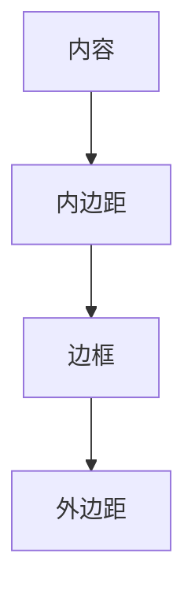

## 介绍

在网页设计中，HTML盒模型是一个核心概念，它定义了HTML元素如何在页面上布局和显示。每个HTML元素都可以看作是一个矩形的盒子，这个盒子由内容（content）、内边距（padding）、边框（border）和外边距（margin）组成。理解盒模型对于掌握网页布局至关重要。

## 盒模型的组成部分

HTML盒模型由以下几个部分组成：

1. **内容（Content）**：这是盒子的核心部分，包含实际的内容，如文本、图片等。
2. **内边距（Padding）**：内容与边框之间的空间。内边距是透明的，不会影响内容的大小。
3. **边框（Border）**：围绕内容和内边距的边框。边框可以有颜色、宽度和样式。
4. **外边距（Margin）**：边框外部的空间。外边距是透明的，用于控制元素与其他元素之间的距离。



## 盒模型的尺寸计算

盒模型的总宽度和高度可以通过以下公式计算：

- **总宽度** = 内容宽度 + 左内边距 + 右内边距 + 左边框 + 右边框 + 左外边距 + 右外边距
- **总高度** = 内容高度 + 上内边距 + 下内边距 + 上边框 + 下边框 + 上外边距 + 下外边距

:::tip
在CSS中，你可以使用 `box-sizing` 属性来控制盒模型的尺寸计算方式。默认情况下，`box-sizing` 的值为 `content-box`，这意味着宽度和高度仅包括内容部分。如果你将其设置为 `border-box`，则宽度和高度将包括内容、内边距和边框。
:::

## 代码示例

以下是一个简单的HTML和CSS示例，展示了盒模型的各个部分：

```html
<div class="box">
  这是一个盒模型示例
</div>
```

```css
.box {
  width: 200px;
  height: 100px;
  padding: 20px;
  border: 5px solid black;
  margin: 10px;
  background-color: lightblue;
}
```

在这个示例中，`.box` 元素的总宽度为：

```
200px (内容宽度) + 20px (左内边距) + 20px (右内边距) + 5px (左边框) + 5px (右边框) + 10px (左外边距) + 10px (右外边距) = 270px
```

总高度为：

```
100px (内容高度) + 20px (上内边距) + 20px (下内边距) + 5px (上边框) + 5px (下边框) + 10px (上外边距) + 10px (下外边距) = 170px
```

## 实际应用场景

盒模型在网页布局中无处不在。例如，当你设计一个导航栏时，你可能需要设置内边距来增加按钮的可点击区域，或者使用外边距来控制按钮之间的距离。

```html
<nav>
  <a href="#">首页</a>
  <a href="#">关于我们</a>
  <a href="#">联系我们</a>
</nav>
```

```css
nav a {
  padding: 10px 20px;
  margin: 0 10px;
  border: 2px solid #333;
  background-color: #f4f4f4;
  text-decoration: none;
  color: #333;
}
```

在这个例子中，每个链接都有内边距和边框，使得它们看起来像按钮，而外边距则用于控制按钮之间的间距。

## 总结

HTML盒模型是网页布局的基础，理解其组成部分和尺寸计算方式对于创建复杂的网页布局至关重要。通过合理使用内边距、边框和外边距，你可以精确控制元素在页面上的显示效果。

## 附加资源与练习

- **练习**：尝试创建一个包含多个盒子的网页布局，并调整它们的内边距、边框和外边距，观察它们如何影响布局。
- **资源**：阅读MDN文档中关于[盒模型](https://developer.mozilla.org/zh-CN/docs/Learn/CSS/Building_blocks/The_box_model)的更多内容，深入了解盒模型的高级用法。

:::caution
在实际开发中，不同浏览器可能会对盒模型的渲染方式有所不同。确保使用CSS重置或标准化样式表来避免不一致的布局问题。
:::