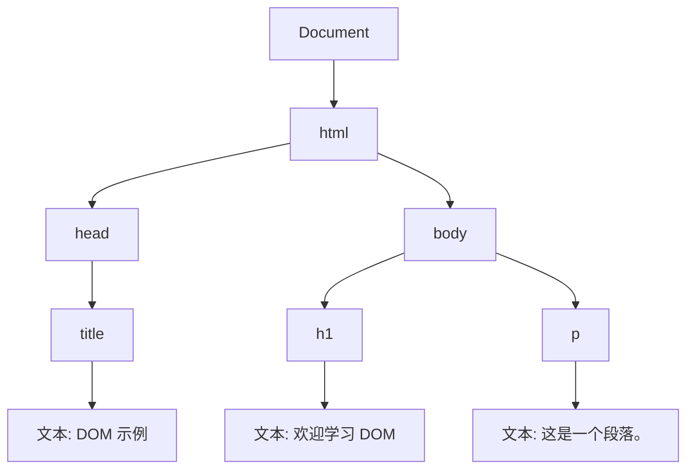

## 什么是 HTML DOM 模型？

HTML DOM（Document Object Model，文档对象模型）是 HTML 和 XML 文档的编程接口。它将文档表示为一个树形结构，其中每个节点都是一个对象，代表文档的一部分（如元素、属性、文本等）。通过 DOM，开发者可以使用 JavaScript 动态地访问、修改、添加或删除 HTML 内容。

DOM 的核心思想是将 HTML 文档视为一个由节点组成的树形结构，每个节点都可以通过 JavaScript 进行操作。这使得网页能够动态地响应用户交互或数据变化。

---

## DOM 树结构

DOM 树是由节点（Node）组成的层次结构。以下是 DOM 树的基本组成部分：

1. **文档节点（Document Node）**：代表整个 HTML 文档。
2. **元素节点（Element Node）**：代表 HTML 元素，如 `<div>`、`<p>` 等。
3. **属性节点（Attribute Node）**：代表 HTML 元素的属性，如 `class`、`id` 等。
4. **文本节点（Text Node）**：代表元素内的文本内容。

以下是一个简单的 HTML 文档及其对应的 DOM 树结构：

```html
<!DOCTYPE html>
<html>
  <head>
    <title>DOM 示例</title>
  </head>
  <body>
    <h1>欢迎学习 DOM</h1>
    <p>这是一个段落。</p>
  </body>
</html>
```

对应的 DOM 树结构如下：



---

## 如何访问 DOM 元素？

JavaScript 提供了多种方法来访问 DOM 元素。以下是一些常用的方法：

### 1. 通过 `id` 访问元素

使用 `document.getElementById()` 方法可以通过元素的 `id` 属性访问元素。

```html
<p id="demo">这是一个段落。</p>
```

```javascript
let element = document.getElementById("demo");
console.log(element.textContent); // 输出: 这是一个段落。
```

### 2. 通过 `class` 访问元素

使用 `document.getElementsByClassName()` 方法可以通过元素的 `class` 属性访问元素。返回的是一个 HTMLCollection。

```html
<p class="example">段落 1</p>
<p class="example">段落 2</p>
```

```javascript
let elements = document.getElementsByClassName("example");
console.log(elements[0].textContent); // 输出: 段落 1
```

### 3. 通过标签名访问元素

使用 `document.getElementsByTagName()` 方法可以通过标签名访问元素。返回的是一个 HTMLCollection。

```html
<p>段落 1</p>
<p>段落 2</p>
```

```javascript
let paragraphs = document.getElementsByTagName("p");
console.log(paragraphs[1].textContent); // 输出: 段落 2
```

### 4. 通过 CSS 选择器访问元素

使用 `document.querySelector()` 和 `document.querySelectorAll()` 方法可以通过 CSS 选择器访问元素。

```html
<div class="container">
  <p>段落 1</p>
  <p>段落 2</p>
</div>
```

```javascript
let firstParagraph = document.querySelector(".container p");
console.log(firstParagraph.textContent); // 输出: 段落 1

let allParagraphs = document.querySelectorAll(".container p");
allParagraphs.forEach(p => console.log(p.textContent)); // 输出: 段落 1, 段落 2
```

---

## 如何修改 DOM 元素？

通过 JavaScript，我们可以动态地修改 DOM 元素的内容、样式和属性。

### 1. 修改元素内容

使用 `innerHTML` 或 `textContent` 属性可以修改元素的内容。

```html
<p id="demo">原始内容</p>
```

```javascript
let element = document.getElementById("demo");
element.innerHTML = "<strong>新内容</strong>"; // 修改为带 HTML 标签的内容
element.textContent = "纯文本内容"; // 修改为纯文本内容
```

### 2. 修改元素样式

通过 `style` 属性可以直接修改元素的 CSS 样式。

```html
<p id="demo">这是一个段落。</p>
```

```javascript
let element = document.getElementById("demo");
element.style.color = "red";
element.style.fontSize = "20px";
```

### 3. 修改元素属性

使用 `setAttribute()` 方法可以修改元素的属性。

```html

```

```javascript
let image = document.getElementById("logo");
image.setAttribute("src", "new-image.png");
```

---

## 实际应用场景

### 动态表单验证

在表单提交时，可以通过 DOM 操作动态地验证用户输入并显示错误信息。

```html
<form id="myForm">
  <input type="text" id="username" placeholder="用户名" />
  <span id="error" style="color: red; display: none;">用户名不能为空</span>
  <button type="submit">提交</button>
</form>
```

```javascript
document.getElementById("myForm").addEventListener("submit", function(event) {
  let username = document.getElementById("username").value;
  let error = document.getElementById("error");

  if (username.trim() === "") {
    error.style.display = "inline";
    event.preventDefault(); // 阻止表单提交
  } else {
    error.style.display = "none";
  }
});
```

---

## 总结

HTML DOM 模型是网页开发的核心概念之一。通过 DOM，我们可以使用 JavaScript 动态地操作网页内容，从而实现丰富的交互效果。掌握 DOM 的基本操作（如访问、修改元素）是成为一名前端开发者的重要一步。

---

## 附加资源与练习

- **练习 1**：创建一个按钮，点击时改变页面背景颜色。
- **练习 2**：实现一个简单的待办事项列表，允许用户添加和删除任务。
- **推荐阅读**：
  - [MDN Web Docs: DOM 介绍](https://developer.mozilla.org/zh-CN/docs/Web/API/Document_Object_Model/Introduction)
  - [JavaScript DOM 编程艺术](https://book.douban.com/subject/6038371/)

:::tip
尝试使用 `console.log()` 打印 DOM 元素，观察其属性和方法，这将帮助你更好地理解 DOM 结构。
:::