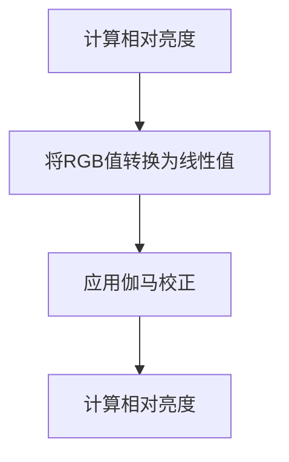

# HTML 色彩对比度

在网页设计中，色彩对比度是一个至关重要的概念，尤其是在确保网站对所有用户（包括视觉障碍用户）可访问时。色彩对比度指的是文本颜色与背景颜色之间的亮度差异。良好的对比度可以确保文本清晰易读，而低对比度则可能导致阅读困难。

## 为什么色彩对比度重要？

色彩对比度直接影响用户阅读内容的体验。对于视觉障碍用户，尤其是色盲或低视力用户，足够的对比度是确保他们能够顺利浏览网站的关键。此外，良好的对比度也有助于所有用户在光线不佳的环境下阅读内容。

:::note
根据[Web内容可访问性指南（WCAG）](https://www.w3.org/WAI/standards-guidelines/wcag/)，文本与背景的对比度至少应达到4.5:1（AA级）或7:1（AAA级）。
:::

## 如何计算色彩对比度？

色彩对比度是通过计算两种颜色的相对亮度来确定的。相对亮度是基于颜色的RGB值计算的，公式如下：



具体公式如下：

1. 将RGB值转换为线性值：
   - `R = R / 255`
   - `G = G / 255`
   - `B = B / 255`

2. 应用伽马校正：
   - `R = (R <= 0.03928) ? R / 12.92 : ((R + 0.055) / 1.055) ^ 2.4`
   - `G = (G <= 0.03928) ? G / 12.92 : ((G + 0.055) / 1.055) ^ 2.4`
   - `B = (B <= 0.03928) ? B / 12.92 : ((B + 0.055) / 1.055) ^ 2.4`

3. 计算相对亮度：
   - `L = 0.2126 * R + 0.7152 * G + 0.0722 * B`

4. 计算对比度：
   - `对比度 = (L1 + 0.05) / (L2 + 0.05)`，其中`L1`是较亮颜色的相对亮度，`L2`是较暗颜色的相对亮度。

## 代码示例

以下是一个简单的HTML和CSS示例，展示如何设置符合WCAG标准的色彩对比度：

```html
<!DOCTYPE html>
<html lang="zh-CN">
<head>
    <meta charset="UTF-8">
    <meta name="viewport" content="width=device-width, initial-scale=1.0">
    <title>色彩对比度示例</title>
    <style>
        body {
            background-color: #ffffff; /* 白色背景 */
            color: #333333; /* 深灰色文本 */
        }
        .high-contrast {
            background-color: #000000; /* 黑色背景 */
            color: #ffffff; /* 白色文本 */
        }
    </style>
</head>
<body>
    <p>这是一个符合WCAG标准的文本示例。</p>
    <p class="high-contrast">这是一个高对比度的文本示例。</p>
</body>
</html>
```

:::tip
使用在线工具（如[WebAIM Contrast Checker](https://webaim.org/resources/contrastchecker/)）可以快速检查文本与背景的对比度是否符合WCAG标准。
:::

## 实际案例

假设你正在为一个新闻网站设计一个文章页面。为了确保所有用户都能轻松阅读文章内容，你需要选择合适的文本颜色和背景颜色。

1. **背景颜色**：`#f0f0f0`（浅灰色）
2. **文本颜色**：`#333333`（深灰色）

使用在线工具检查这两种颜色的对比度，结果为6.5:1，符合WCAG AA级标准。

## 总结

色彩对比度是网页可访问性的重要组成部分。通过确保文本与背景之间有足够的对比度，你可以显著提高网站的可读性和用户体验。始终遵循WCAG指南，并使用工具验证你的设计。

## 附加资源

- [WebAIM Contrast Checker](https://webaim.org/resources/contrastchecker/)
- [WCAG 2.1 Guidelines](https://www.w3.org/TR/WCAG21/)
- [MDN Web Docs: Color Contrast](https://developer.mozilla.org/en-US/docs/Web/Accessibility/Understanding_WCAG/Perceivable/Color_contrast)

## 练习

1. 选择一个你喜欢的网站，检查其文本与背景的对比度是否符合WCAG标准。
2. 尝试使用不同的颜色组合，并使用在线工具验证其对比度。
3. 修改一个现有的网页，使其符合WCAG AA级或AAA级标准。

通过实践，你将更好地理解色彩对比度的重要性，并能够在未来的项目中应用这些知识。