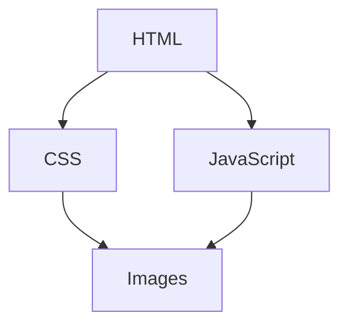

# HTML 性能分析工具

在构建现代网页时，性能优化是一个至关重要的环节。HTML作为网页的基础结构，其性能直接影响页面的加载速度和用户体验。为了帮助开发者更好地分析和优化HTML性能，许多工具应运而生。本文将介绍几种常用的HTML性能分析工具，并通过实际案例展示如何使用这些工具来提升网页性能。

## 什么是HTML性能分析工具？

HTML性能分析工具是一类用于检测和优化网页性能的工具。它们可以帮助开发者识别网页加载过程中的瓶颈，例如未压缩的资源、过多的HTTP请求、渲染阻塞等问题。通过使用这些工具，开发者可以有针对性地优化HTML代码，从而提升网页的加载速度和响应时间。

## 常用的HTML性能分析工具

### 1. Lighthouse

Lighthouse 是 Google 提供的一个开源工具，集成在 Chrome 开发者工具中。它可以对网页进行全面的性能分析，并生成详细的报告。

#### 如何使用 Lighthouse

1. 打开 Chrome 浏览器，进入你想要分析的网页。
2. 右键点击页面，选择“检查”以打开开发者工具。
3. 在开发者工具中，切换到“Lighthouse”标签。
4. 点击“生成报告”按钮，Lighthouse 将开始分析网页性能。

:::tip
Lighthouse 不仅可以分析性能，还可以检查网页的可访问性、最佳实践、SEO 等方面。
:::

#### 示例报告

```json
{
  "performance": 85,
  "accessibility": 92,
  "best-practices": 89,
  "seo": 94
}
```

### 2. WebPageTest

WebPageTest 是一个在线工具，允许开发者从全球多个地点测试网页的加载性能。它提供了详细的瀑布图，展示了每个资源的加载时间。

#### 如何使用 WebPageTest

1. 访问 [WebPageTest](https://www.webpagetest.org/) 网站。
2. 输入你想要测试的网页URL。
3. 选择测试地点和浏览器。
4. 点击“开始测试”按钮，等待测试结果。

:::note
WebPageTest 还提供了视频录制功能，可以查看网页加载的整个过程。
:::

#### 示例瀑布图



### 3. GTmetrix

GTmetrix 是另一个流行的在线性能分析工具，它结合了 Google PageSpeed Insights 和 Yahoo! YSlow 的规则，提供了详细的性能报告。

#### 如何使用 GTmetrix

1. 访问 [GTmetrix](https://gtmetrix.com/) 网站。
2. 输入你想要测试的网页URL。
3. 点击“分析”按钮，等待测试结果。

:::caution
GTmetrix 提供了免费和付费版本，免费版本可能会有一些功能限制。
:::

#### 示例报告

```json
{
  "PageSpeed Score": 90,
  "YSlow Score": 85,
  "Fully Loaded Time": 2.5
}
```

## 实际案例

假设你正在开发一个电商网站，用户反馈页面加载速度较慢。你可以使用 Lighthouse 来分析页面性能，发现主要问题是图片未压缩和过多的HTTP请求。

### 优化步骤

1. **压缩图片**：使用工具如 [ImageOptim](https://imageoptim.com/) 压缩图片，减少文件大小。
2. **合并CSS和JavaScript文件**：减少HTTP请求次数，将多个CSS和JavaScript文件合并为一个。
3. **使用CDN**：将静态资源托管在CDN上，加快资源加载速度。

### 优化前后对比

| 指标          | 优化前 | 优化后 |
|---------------|--------|--------|
| 页面加载时间  | 5.2s   | 2.8s   |
| HTTP请求次数  | 45     | 20     |
| 图片大小      | 2.5MB  | 1.2MB  |

## 总结

HTML性能分析工具是优化网页性能的利器。通过使用这些工具，开发者可以快速识别性能瓶颈，并采取相应的优化措施。无论是 Lighthouse、WebPageTest 还是 GTmetrix，它们都能为你的网页性能优化提供有力的支持。

## 附加资源

- [Google Developers: Web Fundamentals](https://developers.google.com/web/fundamentals/)
- [WebPageTest Documentation](https://docs.webpagetest.org/)
- [GTmetrix Blog](https://gtmetrix.com/blog/)

## 练习

1. 使用 Lighthouse 分析你当前正在开发的网页，记录下性能评分。
2. 尝试使用 WebPageTest 测试同一网页，比较两者的分析结果。
3. 根据分析结果，优化你的网页，并再次测试性能。

通过不断实践，你将能够熟练掌握这些工具，并显著提升网页性能。