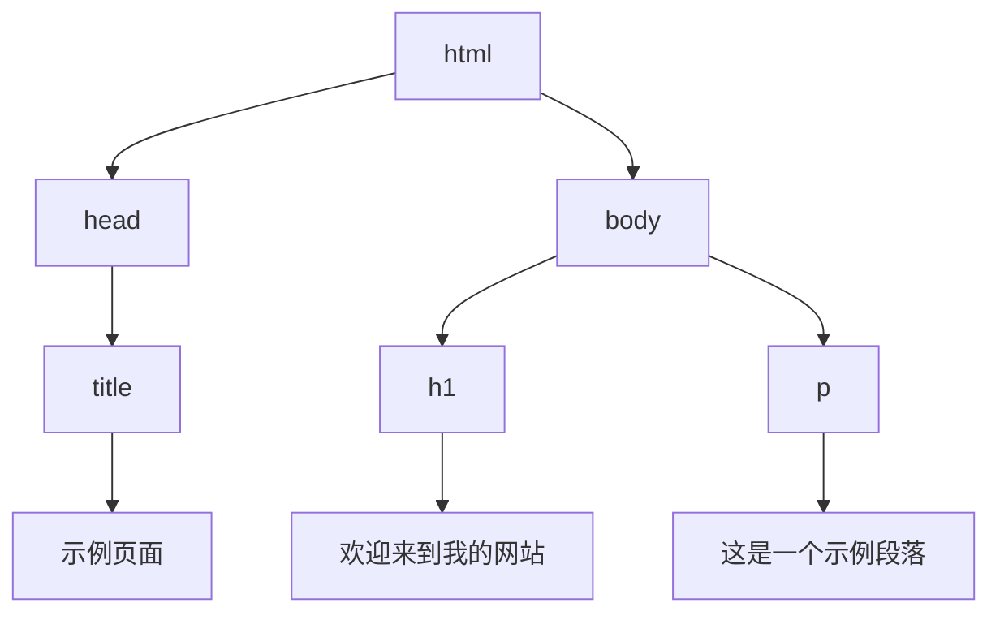
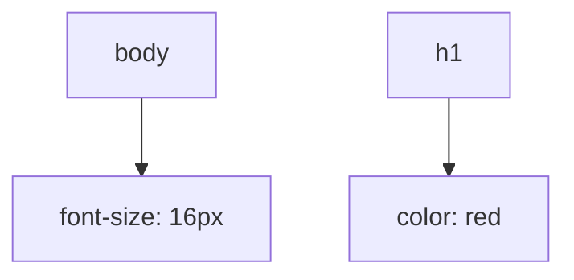
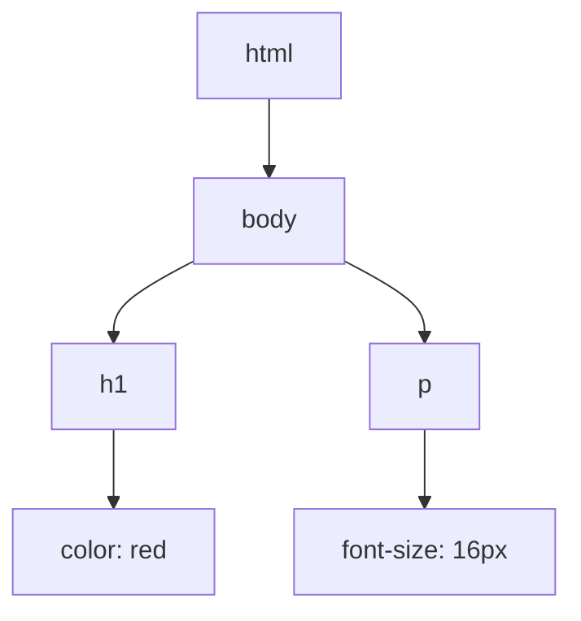
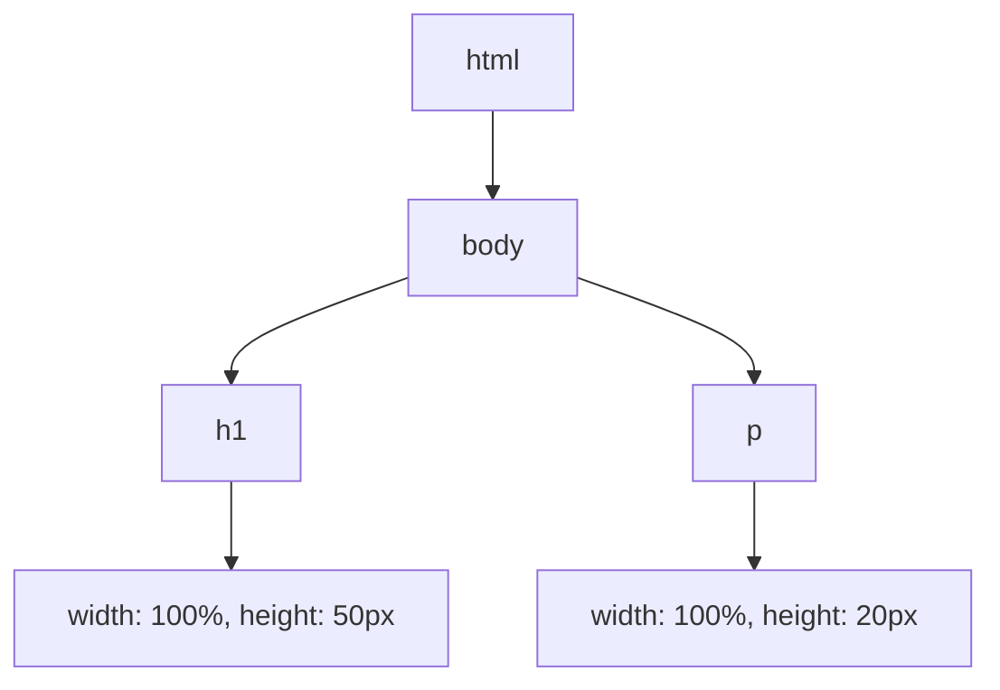
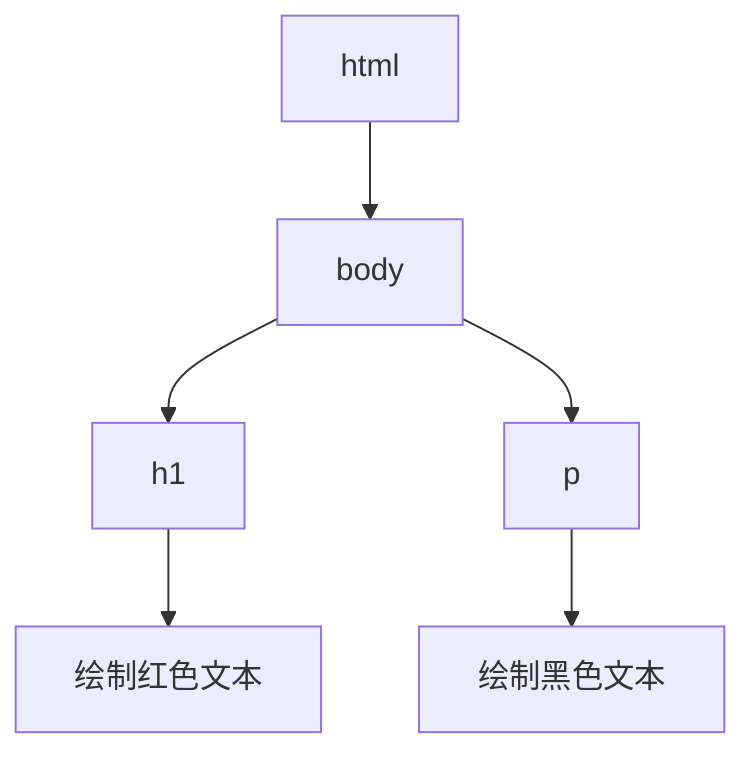

## 什么是HTML关键渲染路径？

HTML关键渲染路径（Critical Rendering Path, CRP）是指浏览器从接收HTML、CSS和JavaScript文件到将这些资源渲染成可视化页面的过程。理解这一过程对于优化网页性能至关重要，因为它直接影响用户首次看到页面内容的速度。

关键渲染路径包括以下几个主要阶段：

1. **构建DOM树**：浏览器解析HTML并构建文档对象模型（DOM）。
2. **构建CSSOM树**：浏览器解析CSS并构建CSS对象模型（CSSOM）。
3. **生成渲染树**：将DOM和CSSOM结合，生成渲染树（Render Tree）。
4. **布局（Layout）**：计算渲染树中每个节点的几何信息（位置和大小）。
5. **绘制（Paint）**：将渲染树的节点绘制到屏幕上。

:::note
关键渲染路径的优化目标是减少页面首次渲染所需的时间，从而提升用户体验。
:::

## 关键渲染路径的详细步骤

### 1. 构建DOM树

当浏览器接收到HTML文件时，它会逐步解析HTML并构建DOM树。DOM树是一个树状结构，表示HTML文档的层次结构。

```html
<!DOCTYPE html>
<html>
  <head>
    <title>示例页面</title>
  </head>
  <body>
    <h1>欢迎来到我的网站</h1>
    <p>这是一个示例段落。</p>
  </body>
</html>
```

上述HTML代码会被解析为以下DOM树结构：



:::tip
DOM树的构建是逐步进行的，因此浏览器可以在解析HTML的同时开始构建DOM树。
:::

### 2. 构建CSSOM树

在构建DOM树的同时，浏览器也会解析CSS文件并构建CSSOM树。CSSOM树与DOM树类似，但它表示的是CSS样式的层次结构。

```css
body {
  font-size: 16px;
}
h1 {
  color: red;
}
```

上述CSS代码会被解析为以下CSSOM树结构：



:::caution
CSSOM树的构建是阻塞渲染的，这意味着浏览器必须等待CSS文件完全下载并解析完成后才能继续渲染页面。
:::

### 3. 生成渲染树

渲染树是DOM树和CSSOM树的结合体。它只包含需要在页面上显示的元素及其样式信息。



:::note
渲染树中不包含不可见的元素，例如 `display: none` 的元素。
:::

### 4. 布局（Layout）

布局阶段，浏览器会计算渲染树中每个节点的几何信息，包括位置和大小。这个过程也被称为“回流”（Reflow）。



:::warning
布局是一个计算密集型的过程，频繁的布局操作会导致性能问题。
:::

### 5. 绘制（Paint）

在绘制阶段，浏览器会将渲染树的节点绘制到屏幕上。这个过程也被称为“重绘”（Repaint）。



:::tip
绘制阶段通常比布局阶段更快，但仍然需要优化以减少页面加载时间。
:::

## 实际案例

假设我们有一个简单的网页，包含一个标题和一个段落。为了优化关键渲染路径，我们可以采取以下措施：

1. **内联关键CSS**：将关键的CSS样式直接内联到HTML中，以减少CSS文件的下载时间。
2. **异步加载非关键CSS**：使用 `media` 属性或 `preload` 来异步加载非关键CSS文件。
3. **延迟加载JavaScript**：将非关键的JavaScript文件延迟加载，以避免阻塞渲染。

```html
<!DOCTYPE html>
<html>
  <head>
    <style>
      body {
        font-size: 16px;
      }
      h1 {
        color: red;
      }
    </style>
    <link rel="stylesheet" href="non-critical.css" media="print" onload="this.media='all'">
    <script src="non-critical.js" defer></script>
  </head>
  <body>
    <h1>欢迎来到我的网站</h1>
    <p>这是一个示例段落。</p>
  </body>
</html>
```

:::note
通过内联关键CSS和延迟加载非关键资源，可以显著减少页面首次渲染的时间。
:::

## 总结

HTML关键渲染路径是浏览器将HTML、CSS和JavaScript转换为可视化页面的过程。通过理解并优化这一过程，可以显著提升网页的加载速度和用户体验。关键优化措施包括内联关键CSS、异步加载非关键资源以及延迟加载JavaScript。

## 附加资源

- [Google Developers: Critical Rendering Path](https://developers.google.com/web/fundamentals/performance/critical-rendering-path)
- [MDN Web Docs: Critical Rendering Path](https://developer.mozilla.org/en-US/docs/Web/Performance/Critical_rendering_path)

## 练习

1. 尝试在一个简单的HTML页面中内联关键CSS，并观察页面加载速度的变化。
2. 使用 `defer` 或 `async` 属性加载JavaScript文件，并比较其对页面渲染的影响。
3. 使用开发者工具分析页面的关键渲染路径，并找出可以优化的地方。
