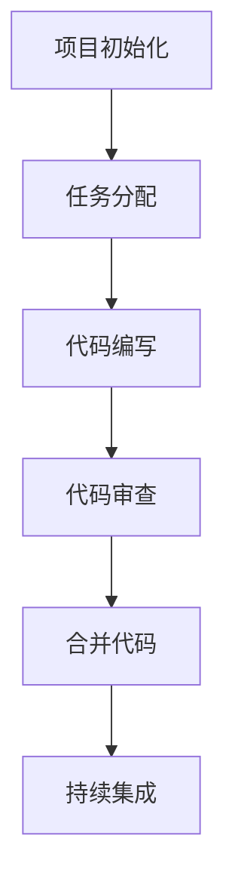

# HTML 团队协作

在现代Web开发中，团队协作是不可或缺的一部分。无论是小型项目还是大型企业级应用，多人协作编写HTML代码都需要遵循一定的规范和最佳实践，以确保代码的一致性和可维护性。本文将介绍如何在团队中高效协作编写HTML代码，并提供实际案例和工具建议。

## 为什么团队协作中的HTML规范很重要？

在团队协作中，每个开发者都有自己的编码风格和习惯。如果没有统一的规范，可能会导致以下问题：

- **代码不一致**：不同开发者编写的代码风格不同，难以阅读和维护。
- **冲突增加**：在版本控制系统中，代码冲突的可能性增加。
- **效率降低**：团队成员需要花费额外时间理解他人的代码。

通过制定统一的HTML规范，团队可以避免这些问题，提高开发效率和代码质量。

## HTML 团队协作的最佳实践

### 1. 使用一致的代码风格

统一的代码风格是团队协作的基础。以下是一些常见的HTML代码风格建议：

- **缩进**：使用2个空格或4个空格进行缩进，避免使用Tab键。
- **标签闭合**：确保所有标签都正确闭合，即使是自闭合标签（如 `` 或 `<br />`）。
- **属性顺序**：按照一致的顺序编写属性，例如 `class`、`id`、`src` 等。
- **注释**：在复杂的HTML结构中添加注释，帮助其他开发者理解代码。

```html
<!-- 示例：一致的代码风格 -->
<div class="container">
  
  <h1 class="title">Welcome to Our Website</h1>
  <p class="description">This is a sample paragraph.</p>
</div>
```

### 2. 使用语义化HTML

语义化HTML不仅有助于SEO和可访问性，还能让代码更易于理解。团队应尽量使用语义化标签，如 `<header>`、`<nav>`、`<main>`、`<section>` 和 `<footer>`，而不是滥用 `<div>`。

```html
<!-- 示例：语义化HTML -->
<header>
  <nav>
    <ul>
      <li><a href="/">Home</a></li>
      <li><a href="/about">About</a></li>
    </ul>
  </nav>
</header>
<main>
  <section>
    <h1>About Us</h1>
    <p>We are a team of web developers.</p>
  </section>
</main>
<footer>
  <p>&copy; 2023 Our Company</p>
</footer>
```

### 3. 使用版本控制系统

版本控制系统（如Git）是团队协作的核心工具。通过Git，团队成员可以轻松管理代码变更、解决冲突并跟踪项目历史。以下是一些Git使用建议：

- **分支策略**：使用分支（如 `feature`、`bugfix`）来隔离开发任务。
- **提交信息**：编写清晰、简洁的提交信息，描述代码变更的目的。
- **代码审查**：通过Pull Request进行代码审查，确保代码质量。

:::tip
在团队中使用Git时，建议制定分支命名规范和提交信息模板，以保持一致性。
:::

### 4. 使用代码格式化工具

手动格式化代码容易出错且耗时。使用代码格式化工具（如Prettier）可以自动格式化HTML代码，确保团队代码风格一致。

```bash
# 安装Prettier
npm install --save-dev prettier

# 格式化HTML文件
npx prettier --write index.html
```

### 5. 编写可重用的组件

在大型项目中，HTML代码可能会重复多次。通过将重复的HTML结构提取为可重用的组件，可以减少代码冗余并提高可维护性。例如，可以使用模板引擎（如Handlebars）或前端框架（如React）来实现组件化。

```html
<!-- 示例：可重用的导航栏组件 -->
<nav class="navbar">
  <ul>
    <li><a href="/">Home</a></li>
    <li><a href="/about">About</a></li>
    <li><a href="/contact">Contact</a></li>
  </ul>
</nav>
```

## 实际案例：团队协作开发一个博客网站

假设一个团队正在开发一个博客网站，以下是他们的协作流程：

1. **项目初始化**：使用Git初始化项目，并创建 `main` 分支。
2. **任务分配**：将任务分配给团队成员，例如首页、博客列表页和博客详情页。
3. **代码编写**：每个成员在自己的分支上编写HTML代码，遵循统一的代码风格和语义化HTML规范。
4. **代码审查**：通过Pull Request提交代码，其他成员进行审查并提出改进建议。
5. **合并代码**：审查通过后，将代码合并到 `main` 分支。
6. **持续集成**：使用CI工具（如GitHub Actions）自动格式化代码并运行测试。



## 总结

在团队协作中，遵循HTML最佳实践是确保代码质量和开发效率的关键。通过统一的代码风格、语义化HTML、版本控制和代码格式化工具，团队可以高效协作并减少冲突。希望本文的内容能帮助你在团队中更好地编写和维护HTML代码。

## 附加资源与练习

- **练习**：尝试与朋友或同事一起开发一个简单的网页，实践本文提到的团队协作技巧。
- **资源**：
  - [Prettier官方文档](https://prettier.io/)
  - [Git官方文档](https://git-scm.com/doc)
  - [HTML语义化指南](https://developer.mozilla.org/zh-CN/docs/Glossary/Semantics)
