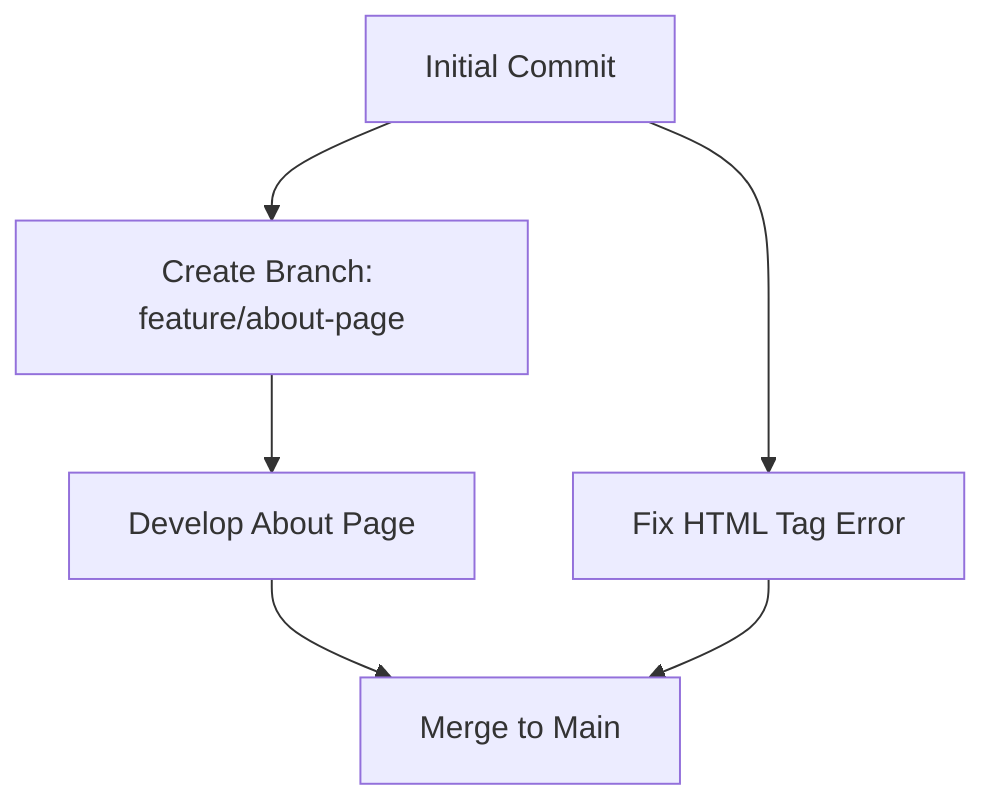

# HTML 版本控制

在现代Web开发中，HTML版本控制是一个至关重要的概念。它不仅仅是管理代码变更的工具，更是团队协作和项目维护的核心。本文将详细介绍HTML版本控制的基本概念、实际应用场景以及如何通过版本控制系统（如Git）来管理HTML代码。

## 什么是HTML版本控制？

HTML版本控制是指通过使用版本控制系统（VCS）来跟踪和管理HTML文件的变更。版本控制系统允许开发者记录每一次代码的修改，并在需要时回滚到之前的版本。这对于团队协作、错误修复和代码审查至关重要。

:::note
版本控制系统不仅适用于HTML，还可以用于管理CSS、JavaScript和其他类型的文件。
:::

## 为什么需要HTML版本控制？

1. **协作开发**：在团队中，多个开发者可能同时修改同一个HTML文件。版本控制系统可以帮助解决冲突，并确保每个人的更改都能被正确合并。
2. **错误修复**：如果某个版本的HTML代码引入了错误，版本控制系统允许你轻松回滚到之前的稳定版本。
3. **历史记录**：版本控制系统记录了每一次代码的变更，方便开发者查看代码的演变过程。
4. **分支管理**：通过创建分支，开发者可以在不影响主代码的情况下进行实验性开发。

## 如何使用Git进行HTML版本控制？

Git是目前最流行的版本控制系统之一。以下是如何使用Git来管理HTML代码的基本步骤。

### 1. 初始化Git仓库

首先，你需要在项目目录中初始化一个Git仓库：

```bash
git init
```

### 2. 添加HTML文件到仓库

将HTML文件添加到Git仓库中：

```bash
git add index.html
```

### 3. 提交更改

提交更改并添加提交信息：

```bash
git commit -m "Initial commit with basic HTML structure"
```

### 4. 查看历史记录

你可以使用以下命令查看提交历史：

```bash
git log
```

### 5. 创建分支

如果你想在不影响主分支的情况下进行开发，可以创建一个新分支：

```bash
git branch feature/new-section
git checkout feature/new-section
```

### 6. 合并分支

当新功能开发完成后，你可以将其合并到主分支：

```bash
git checkout main
git merge feature/new-section
```

## 实际案例

假设你正在开发一个简单的博客网站，以下是使用Git进行版本控制的示例场景：

1. **初始提交**：你创建了一个基本的HTML结构并提交到Git仓库。
2. **添加新功能**：你决定在博客中添加一个“关于”页面，于是创建了一个新分支 `feature/about-page` 并在该分支上开发。
3. **修复错误**：在主分支上，你发现了一个HTML标签错误，于是你修复了错误并提交了更改。
4. **合并分支**：当“关于”页面开发完成后，你将其合并到主分支。



## 总结

HTML版本控制是Web开发中不可或缺的一部分。通过使用Git等版本控制系统，你可以有效地管理HTML代码的变更，确保项目的可维护性和协作效率。无论是个人项目还是团队开发，版本控制都能帮助你更好地组织代码。

## 附加资源与练习

- **练习**：尝试在一个简单的HTML项目中使用Git进行版本控制。创建多个分支，添加新功能，并练习合并分支。
- **资源**：
  - [Git官方文档](https://git-scm.com/doc)
  - [Pro Git书籍](https://git-scm.com/book/en/v2)
  - [GitHub Guides](https://guides.github.com/)

通过不断练习和探索，你将更加熟练地掌握HTML版本控制的技巧，为未来的Web开发项目打下坚实的基础。